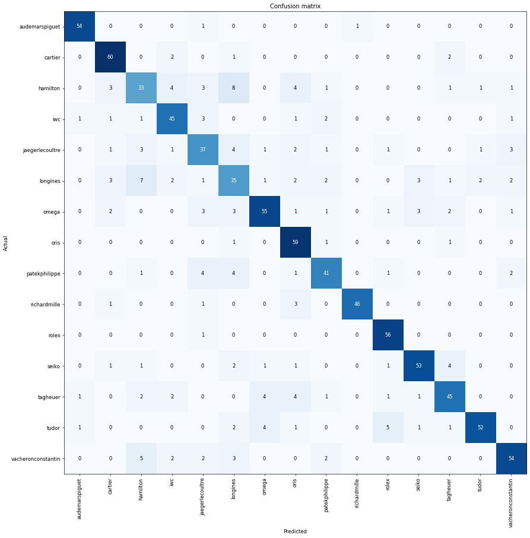

# Watch Watcher
This is a program that takes an image of a watch and can predict the watch's brand and the price on the online watch market. You can access it here: https://huggingface.co/spaces/kevintang513/watch-watcher

## Detailed Project Description and Overview
This is a program that takes an image of a watch and can predict the watch's brand and the price in the online watch market. It can identify and predict the price of 15 popular luxury watch brands. The application consists of a classification and regression model. 

The two models were trained on data scraped from chrono24.com and built with transfer learning using the ResNet50 architecture. Around 300 watch images from each of the 15 selected brands were used to train the models. The building and training of both models was done using Paperspace cloud computing. 

The application is currently hosted on Hugging Face and was built using Gradio.
## Results
The resulting confusion matrix from the classifier model shows that for most brands, our watch does decently well considering the limited amount of data supplied and limited training for the sake of time. Possible improvements can include scraping a larger and more diverse dataset. Many images of the images of chrono24 use profesionally captured images of the watch from largely the same angle. Obtaining more images of watches being actually worn will likely yield better results. Additionally, the current scraper doesn't seek out specific watch models for different brands, thus there may be a bias in our data for each brand's most popular watches.


Our price-estimator regression models also faces some biases. Since the regression model uses a mean square error loss function, our model minimizes the total distance between the actual and predicted price of the watch. Due to vast differences in price between some watches(ex: $500 vs $500k), our model will often overvalue watches due to it trying to minimize the loss for extremely expensive brands such as Richard Mille which have watches with price ranges of $100k-$1.5M+.
## Project Layout
Run `tree -L x` in the directory of the project to get the project layout where x is the directory level to go down. An example:

`tree -L 2`
```
watch_watcher/
├── application
│   ├── app.py
│   ├── app-tester.ipynb
│   ├── price-estimator.pkl
│   ├── watch-classifier.pkl
│   ├── requirements.txt
│   ├── rolex-example.jpg
│   ├── seiko-example.png
│   └── tag-example.png
├── data
│   ├── images
│   └── scraped
├── models
│   ├── regressionv1.pth
│   ├── regressionv2.pth
│   ├── watch-classifierv1.pth
│   └── watch-classifierv2.pth
├── results
│   └── classifier-confusion-matrix.png
├── scraper.py
├── img_downloader.py
├── watch-watcher-classifier.ipynb
└── watch-watcher-regression.ipynb
```

Notes for files and directories to keep track of what they contain:
 - `application`: Directory containing all files required by the gradio application.
  - `app.py`: Script used by Hugging Faces to launch/run the interface.
  - `app-tester.ipynb`: Notebook for testing Gradio app on Paperspace before pushing to Hugging Face.
  - `watch-classifier.pkl`: Brand classification model.
  - `price-estimatore.pkl`: Price estimator regression model.
  - `[BRAND]-example.png`: Examples images availble to the application.
  - `requirements.txt`: Packages needed to run application.
 - `data/scraped`: Each brand's csv files with image links and prices, created by scraper.py .
 - `data/images/`: Contains the labeled images, downloaded with img_downloader.py.
 - `models`: Contains the .pth files, used while training the models and too large for git.
 - `results`: Plots and related files.
 - `scraper.py`: Script used for scraping the data from chrono24.com.
 - `img_downloader.py`: Script for downloading and labeling watch images.
 - `watch-watcher-classifier.ipynb`: Notebook for building the classification model.
 - `watch-watcher-regression.ipynb`: Notebook for building the regression model.
## Contact Details
* Kevin Tang (kevin.tang513@gmail.com)

<!--

Template Notes: 
 - Markdown documentation and cheatsheets:
   - https://www.markdownguide.org/cheat-sheet/
   - https://github.com/adam-p/markdown-here/wiki/Markdown-Cheatsheet

-->
